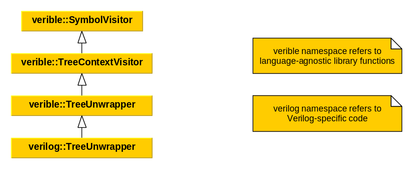

# SystemVerilog Formatter Developer Guide

<!--*
freshness: { owner: 'hzeller' reviewed: '2022-09-16' }
*-->

## Design

This section describes the various subsystems of the Verilog formatter.

### Inter-Token Annotation

Between every pair of adjacent tokens in the to-be-formatted text, there are a
set of attributes that influence spacing and line wrapping decisions,
[InterTokenInfo], such as minimum spacing between tokens.

The role of the [token annotator] is to populate [InterTokenInfo] based on the
attributes, types, and syntactic context of adjacent pairs of tokens. Formatting
rules around punctuation tokens like parenthesis and brackets often depend on
syntactic context.

#### Rules and Reasons

The main functions that determine inter-token attributes are written as
_priority-ordered rules_, i.e. series of `if (condition) return ...;`. There may
be an _O(N^2)_ number of inter-token pair combinations, however, we aim to cover
as much of that space as possible with few rules.
[Test cases](https://cs.opensource.google/verible/verible/+/master:verible/verilog/formatting/token-annotator_test.cc),
however, should cover as much as possible explicitly, to prevent accidental
regression.

When running with logging enabled, you will observe that every value or
attribute returned by these functions is accompanied with a _reason_ string like
_"Always insert a space after X"_. This not only tells you the value returned
but the exact line or rule that triggered it, which is critical for debugging.
When fixing issues, don't immediately think of what code to add to solve an
issue, consider whether a re-ordering of the rules may work. In some case, code
can be simplified by grouping similar case conditions together, or by
generalizing rules more broadly.

### Token Partition Tree

[TokenPartitionTree] is a language-agnostic hierarchical representation of
(formatting) token ranges. The data represented by each node is an
[UnwrappedLine], which contains a range of formatting tokens and indentation
information. [TokenPartitionTree] has the following properties:

*   The range spanned by a node in the tree is equal to the range spanned by its
    children, if there are any.
*   The end points of the tokens ranges of adjacent siblings are equal, or put
    another way, there are no gaps in token ranges between adjacent sibling
    nodes.

The role of the [TreeUnwrapper] is to convert a SystemVerilog concrete syntax
tree into a [TokenPartitionTree]. Once in [TokenPartitionTree] form, the
original syntax structure has been abstracted away and is no longer relevant to
the rest of the formatter. If one chose to implement the formatter without
relying on a valid syntax tree, one only has to produce a [TokenPartitionTree]
form to reuse everything else that follows. For example, one could just as well
produce a [TokenPartitionTree] directly from a lexical token stream. Such a
strategy could better accomodate preprocessing-heavy code which might otherwise
be rejected by the parser before producing a syntax tree, at the expense of
having to do some pseudo-parsing.

Think of each node in the [TokenPartitionTree] representing a formatting
subproblem: _Given a box width constraint, what are the best ways to format a
region of text?_ Leaf partitions of the [TokenPartitionTree] represents a unit
of work that is currently handled by the line-wrapping optimization phase.

### Tree unwrapping

The implemention of [TreeUnwrapper] is split into
[language-agnostic library functions](https://cs.opensource.google/verible/verible/+/master:verible/common/formatting/tree-unwrapper.cc)
and [Verilog-specific](https://cs.opensource.google/verible/verible/+/master:verible/verilog/formatting/formatter.cc) code.

Simplified class inheritance diagram is shown below:

<!-- class diagram can be regenerated with yEd tool https://www.yworks.com/products/yed -->

[TreeUnwrapper] class exploits
the [Visitor](https://cs.opensource.google/verible/verible/+/master:verible/common/text/visitors.h?q=class:SymbolVisitor&ss=verible%2Fverible)
pattern to recursively process the input CST tree:
```cpp
// SymbolVisitor is an abstract visitor class from which visitors can be derived
// SymbolVisitor only visits a single Symbol, and does not recurse on nodes
//
// Usage:
//  SymbolPtr tree = ...
//  SymbolVisitorSubclass visitor;
//  tree->Accept(visitor);
//
class SymbolVisitor {
 public:
  virtual ~SymbolVisitor() {}
  virtual void Visit(const SyntaxTreeLeaf& leaf) = 0;
  virtual void Visit(const SyntaxTreeNode& node) = 0;
};
```

It builds the [TokenPartitionTree] (i.e. `VectorTree<UnwrappedLine>`) with a set of helper methods to simplify the process:
* [`TraverseChildren()`](https://cs.opensource.google/verible/verible/+/master:verible/common/formatting/tree-unwrapper.cc?q=function:TraverseChildren&ss=verible%2Fverible) - only traverses the CST
* [`VisitIndentedSection()`](https://cs.opensource.google/verible/verible/+/master:verible/common/formatting/tree-unwrapper.cc?q=function:VisitIndentedSection&ss=verible%2Fverible) - creates indented section and traverses the CST
* [`VisitNewUnwrappedLine()`](https://cs.opensource.google/verible/verible/+/master:verible/verilog/formatting/tree-unwrapper.cc?q=function:VisitNewUnwrappedLine&ss=verible%2Fverible) - begins a new partition of tokens and traverses the CST

### Custom policies application

The next stage of code formatting is to apply custom functions that would
reshape the partition tree according to the selected policy.
An example of that are the [kTabularAlignment](#alignment) and the
[kAppendFittingSubPartitions](https://cs.opensource.google/verible/verible/+/master:verible/common/formatting/unwrapped-line.h?q=kAppendFittingSubpartitions&ss=verible)
policies.

### Wrapping

Line wrapping optimization is currently done as a Dijsktra shortest-path search
over the space of append/wrap decisions spanning a range of formatting tokens.
When a wrap (line break) is used, the optimization state incurs a penalty value
determined in the token annotation phase. This algorithm is not very scalable,
but there are plans to replace it with something like dynamic programming.

### Disable Control and Preservation

## Troubleshooting

This section provides tips about how to triage formatter issues.

`verible-verilog-syntax --printtree` shows the concrete syntax tree
representation of source code. Many formatting decisions are based on syntax
tree node types, which are shown as constants like `kPackageDeclaration`.

`verible-verilog-format --show_token_partition_tree` shows the
[TokenPartitionTree] subdivision of formatting token ranges and relative
indentation. Add `--show_inter_token_info` to show even more information about
InterTokenInfo before each token.

A lot of other details are traced by running with environment variables
`VERIBLE_LOGTHRESHOLD=0 VERIBLE_VLOG_DETAIL=8`. The log threshold
indicates that we want to see info logs and up (there are four levels: INFO=0,
WARNING=1, ERROR=2, FATAL=3) printed to stderr (without that we wouldn't see
any vlog outputs as they go to INFO), and vlog detail is logging all verbose
logging commands (`VLOG()`) up to and including VLOG detail 8; the higher the
number, the more details.

(TODO: introduce `VERIBLE_VLOG_MODULE` once vmodule available in absl log).
Real world [TreeUnwrapper] example:
```
echo 'module m; initial a = b + c; endmodule' | \
  VERIBLE_LOGTHRESHOLD=0 \
  VERIBLE_VLOG_DETAIL=8 \
  bazel run //verible/verilog/tools/formatter:verible-verilog-format -- -show_token_partition_tree -
```

### Alignment

The tabular alignment feature can be summarized as: _Given a block of code with
syntax-structure similarity, insert spacing needed to achieve vertical alignment
among the same substructure elements._

The implementation of tabular alignment for code is split into
[language-agnostic library functions](https://cs.opensource.google/verible/verible/+/master:verible/common/formatting/align.h)
and
[Verilog-specific](https://cs.opensource.google/verible/verible/+/master:verible/verilog/formatting/align.cc)
uses of alignment functions.

To trigger alignment for a block of code, the [TreeUnwrapper] marks a
[TokenPartitionTree] node with
[`kTabularAlignment`](https://cs.opensource.google/verible/verible/+/master:verible/common/formatting/unwrapped-line.h?q=file:unwrapped-line.h%20usage:kTabularAlignment&ss=verible%2Fverible):
this says that a particular node has some children partitions that _could_ be
aligned.

Once a [TokenPartitionTree] enters the top-level alignment handler, alignment is
done in the following phases:

1.  **Language-specific:** Depending on the syntax tree node type that
    corresponds to each partition, a
    [function](https://cs.opensource.google/verible/verible/+/master:verible/verilog/formatting/align.cc?q=file:align.cc%20usage:kAlignHandlers&ss=verible%2Fverible)
    is chosen that is responsible for finding [AlignablePartitionGroup]s, blocks
    of children partitions that are candidates for aligned formatting. Think of
    these as groups of _rows_ that constitute a table.

    *   The [AlignablePartitionGroup]s returned by from a single parent node
        could cover different syntax constructs, e.g. from a single node
        representing statement elements, you could have groups of declarations,
        and groups of assignment statements.
    *   [AlignablePartitionGroup]s may be sparsely populated if they span
        non-aligned text such as comments.
    *   Each [AlignablePartitionGroup] is assigned a function that is
        responsible for partitioning rows of tokens into _column_ cells.
    *   Finding the start and end points of these candidate alignment groups
        could be based on a number of factors, such as syntax tree node types,
        comments, blank lines.
    *   Every subpartition that is not selected for alignment undergoes
        non-aligned formatting by default.

1.  **Language-agnostic:** Each alignment group analyzes and transforms its rows
    and columns, essentially calculating the maximum width of each column, and
    adjusting [InterTokenInfo] spacing, taking into account left/right flushing.

    *   Each row is scanned to partition its tokens into cells that will be
        binned into columns. This works best when the rows have the same or
        similar syntax structure.
    *   Columns may be empty. Optional syntax construct are blank cells in this
        case.
    *   To bin columns correctly, every cell of tokens is assigned a key that
        corresponds to its position within the parent syntax tree node, a
        _path_, like `[N,M,P]`. This makes it easy to accommodate empty cells in
        each row, and also accommodates a _dynamic_ number of columns. For
        example, data declarations could have any number of columns based on
        dimensions. The path-hierarchical nature and lexicographical ordering of
        keys faciliates dynamic column generation.
    *   Binning cells into columns creates a _column schema_, which compute
        column widths.
    *   Column widths translate to [InterTokenInfo] spacing adjustments.

Should the resulting column widths exceed the column limit (style parameter),
then attempting to align a block of code is abandoned, falling back to
non-aligned formatting.

<!-- TODO: align vs. flush left behavior inferral -->
<!-- reference links -->

[UnwrappedLine]: https://cs.opensource.google/verible/verible/+/master:verible/common/formatting/unwrapped-line.h
[token annotator]: https://cs.opensource.google/verible/verible/+/master:verible/verilog/formatting/token-annotator.h
[InterTokenInfo]: https://cs.opensource.google/verible/verible/+/master:verible/common/formatting/format-token.h;l=59?q=InterTokenInfo
[TreeUnwrapper]: https://cs.opensource.google/verible/verible/+/master:verible/verilog/formatting/tree-unwrapper.h
[TokenPartitionTree]: https://cs.opensource.google/verible/verible/+/master:verible/common/formatting/token-partition-tree.h
[AlignablePartitionGroup]: https://cs.opensource.google/verible/verible/+/master:verible/common/formatting/align.h?q=file:align.h%20class:AlignablePartitionGroup&ss=verible%2Fverible
